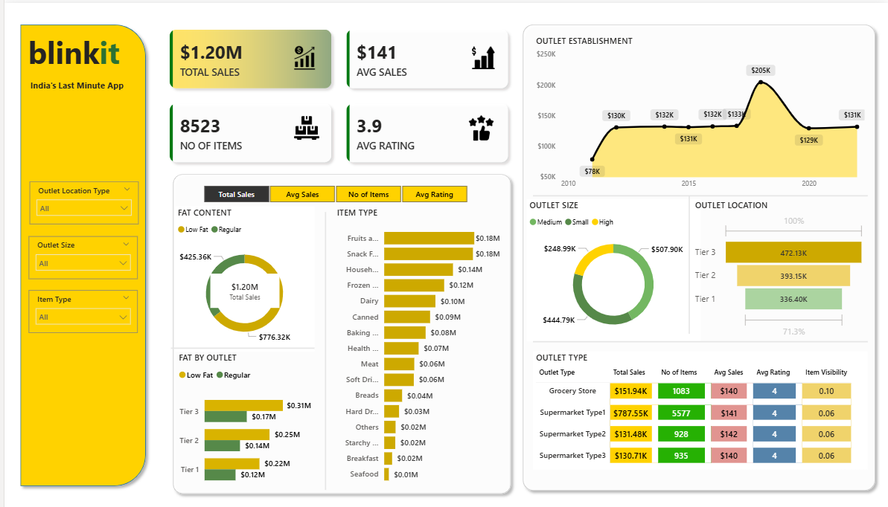

# 🛒 Blinkit Sales Analysis Dashboard (Power BI)

**Author:** Vaishnavi Nagpure
**Project Type:** Academic / Internship Project

🚀 Interactive Power BI dashboard analyzing Blinkit sales data

---

## 📌 Project Type

This is an **academic project** developed as part of an internship/college assignment to demonstrate data analysis and visualization skills using Power BI.

---

## 📖 Project Overview

This project focuses on analyzing retail sales data of Blinkit (formerly Grofers) and presenting insights through an interactive Power BI dashboard.
The dashboard provides a clear understanding of sales trends, product performance, and outlet distribution.

---

## 🎯 Objectives

* Analyze overall sales performance
* Identify top-performing product categories
* Compare outlet performance across locations
* Understand sales trends over time

---

## 🛠 Tools & Technologies

* Power BI
* Power Query (Data Cleaning)
* DAX (Data Analysis Expressions)
* Excel Dataset

---

## 📊 Dashboard Features

* KPI Cards (Total Sales, Average Sales, Number of Items, Average Rating)
* Sales Trend Analysis (Year-wise)
* Category-wise Sales Distribution
* Outlet Size and Location Analysis
* Interactive Filters (Slicers)

---

## 📷 Dashboard Preview



---

## 🔍 Key Insights

* Total sales reached **$1.20M**, indicating strong overall performance
* **Fruits and Snacks** categories generate the highest revenue
* **Tier 3 outlets** outperform Tier 1 and Tier 2 in total sales
* Sales peaked around **2020 (~$205K)** showing a major growth phase
* Medium and Small outlet sizes contribute more than High-size outlets
* Average customer rating of **3.9** reflects moderate satisfaction

---

## 🔄 Data Preparation

* Cleaned and transformed data using Power Query
* Removed missing/null values
* Standardized column names and formats

---

## 📁 Project Structure

```
Blinkit-PowerBI-Sales-Dashboard/
│
├── Blinkit_Dashboard.pbix
├── BlinkIT Grocery Data.xlsx
├── dashboard.png
├── README.md
└── report/
    └── Blinkit_Report.pdf
```

---

## 📄 Project Report

A detailed report of the project is available here:

[Download Report](report/Blinkit_Report.pdf)

---

## 📚 Learning Outcomes

* Gained hands-on experience with Power BI
* Learned data cleaning using Power Query
* Improved dashboard design and visualization skills
* Developed ability to derive insights from raw data

---

## ⚠️ Disclaimer

This project is created for **educational purposes only** and does not represent actual business decisions or official data of Blinkit.

---

⭐ Feel free to explore the project and provide feedback!

